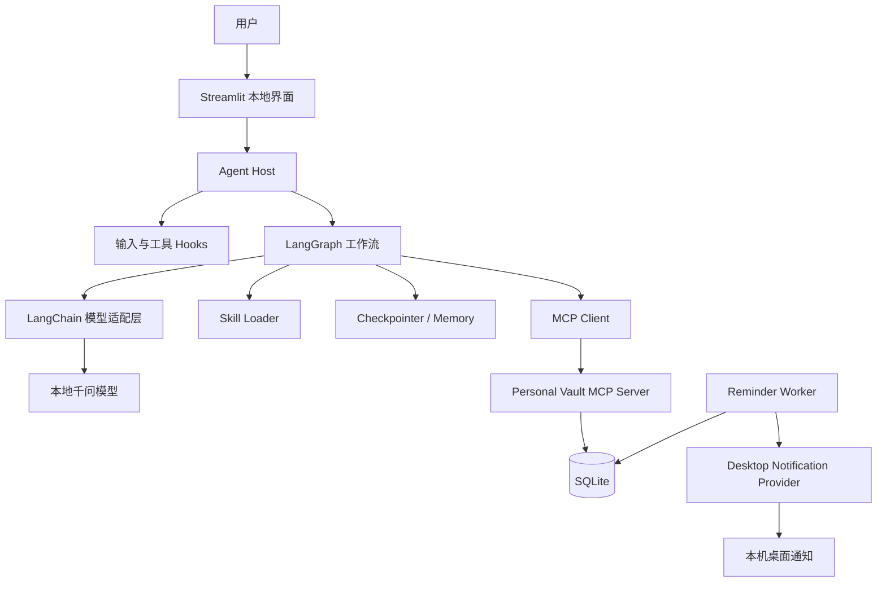
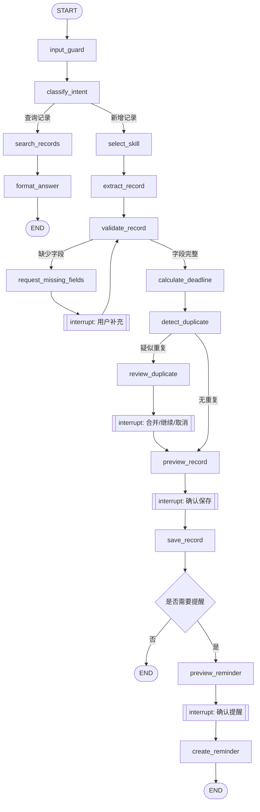
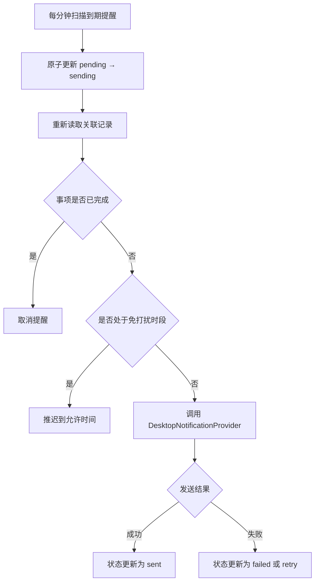

# LifeVault

## 本地生活凭证与到期提醒助手

**完整架构方案：本地模型 / MCP / LangGraph / Skill / Hooks / Memory**

- 版本：MVP 1.0
- 提醒方式：应用内提醒 + 本机桌面通知
- 适用场景：个人学习、作品集展示与简历项目

---

## 文档导航

| 章节 | 内容 |
|---|---|
| 1-3 | 项目定位、用户痛点、MVP 边界 |
| 4-6 | 使用场景、总体架构、组件职责 |
| 7-10 | 数据模型、MCP、LangGraph、提醒 Worker |
| 11-13 | Skill、Hooks、Memory 与八个概念映射 |
| 14-17 | 目录结构、开发路线、测试验收、简历表达 |
| 18 | 最终交付物清单 |

> **最终方案结论**
>
> 第一版取消邮件、微信及第三方账号授权，只保留应用内提醒和本机桌面通知。用户输入生活事项后，本地千问负责理解和结构化提取，Python 工具负责日期计算与校验，LangGraph 负责编排确认流程，MCP Server 负责数据与提醒任务，独立 Worker 负责到期扫描和桌面弹窗。

---

# 1. 项目定位

LifeVault 是一个本地优先的个人生活凭证管理与到期提醒 Agent。用户可以用自然语言记录商品订单、订阅服务和生活账单，系统自动提取字段、计算关键日期、检测重复记录，并在用户确认后创建本地提醒。

**一句话介绍：**用户只负责描述生活事项，系统负责把零散信息变成可查询、可校对、可提醒的结构化记录。

> **设计原则**
>
> 模型负责理解，程序负责计算，MCP 负责副作用边界，用户负责最终确认。

---

# 2. 普通人的真实痛点

- 购买商品后忘记退货截止日期，等想退时已经过期。
- 会员或软件订阅临近续费，但直到扣款后才想起取消。
- 水电、信用卡、房租等账单信息分散，容易漏缴。
- 需要售后时找不到订单号、购买日期或保修凭证。
- 同一事项被反复记录，提醒重复弹出。
- 传统记事软件要求用户手动整理字段，使用成本高。

---

# 3. MVP 产品边界

## 3.1 第一版支持

| 记录类型 | 核心字段 | 典型提醒 |
|---|---|---|
| 商品订单 | 商品、商家、金额、购买日期、订单号、退货天数、保修期限 | 退货截止、保修到期 |
| 订阅服务 | 服务名称、金额、付费周期、最近扣款日、预计续费日、是否自动续费 | 续费前检查 |
| 生活账单 | 账单名称、金额、账单周期、缴费截止日、当前状态 | 缴费截止 |

## 3.2 第一版明确不做

- 自动登录购物平台、银行或支付账户。
- 自动付款、退款、取消订阅或操作浏览器。
- 个人微信机器人、邮件 SMTP、公众号和小程序通知。
- 自动读取全部聊天记录、邮件或相册。
- 多用户组织权限、云端同步和复杂分布式部署。

---

# 4. 核心使用场景

## 4.1 新增订单

用户输入：

> 我昨天在京东买了一个耳机，3499 元，订单号 123456，七天无理由，退货前两天提醒我。

系统提取并计算：

```json
{
  "record_type": "purchase",
  "title": "耳机",
  "merchant": "京东",
  "amount": 3499,
  "purchase_date": "2026-07-25",
  "order_number": "123456",
  "return_days": 7,
  "return_deadline": "2026-08-01",
  "reminder_at": "2026-07-30T09:00:00+08:00"
}
```

其中，“昨天”等相对日期由系统结合当前时间解析，“七天无理由”的截止日期由 Python 日期工具计算。模型不得自行心算或猜测。

## 4.2 到期桌面提醒

到达提醒时间后，本机弹出：

> **LifeVault 到期提醒**
>
> 你的耳机预计还有 2 天结束退货期。

用户可在应用中将事项标记为：

- 已退货
- 决定保留
- 已完成
- 稍后提醒

## 4.3 自然语言查询

用户询问：

> 我最近有哪些东西快过退货期了？

Agent 必须通过 MCP 搜索真实记录，再根据查询结果组织答案，不能凭对话记忆编造。

---

# 5. 总体架构



| 组件 | 主要职责 | 是否允许产生副作用 |
|---|---|---|
| Streamlit 本地界面 | 输入、校对、查询、提醒管理、设置 | 只通过 API 或 Agent 操作 |
| Agent Host | 运行 LangGraph、调用模型、选择 Skill、执行 Hooks | 不直接写数据库或弹通知 |
| 本地千问 | 意图识别、字段提取、候选分类、自然语言回答 | 不允许 |
| Personal Vault MCP Server | 记录、搜索、去重、状态更新、提醒任务 | 允许受控数据库写入 |
| Reminder Worker | 扫描到期任务、重新校验状态、发送桌面通知 | 允许执行本机通知 |
| SQLite | 记录、提醒、图状态、偏好、审计日志 | 权威数据源 |

---

# 6. 模块职责与边界

## 6.1 Streamlit 本地界面

页面包括：

- **添加记录：**自然语言输入，后续可扩展截图和 PDF。
- **校对结果：**编辑模型提取字段，确认后保存。
- **我的记录：**按类型、状态、日期和关键词查询。
- **提醒中心：**查看待提醒、已提醒、已取消和稍后提醒。
- **设置：**默认提前天数、默认提醒时间、免打扰时段。

## 6.2 Agent Host

主要职责：

- 接收输入，生成或恢复 `thread_id`。
- 运行输入 Hook，完成脱敏、长度限制和内容清洗。
- 通过 LangChain 调用本地千问并约束结构化输出。
- 运行 LangGraph 状态机和 Human-in-the-loop 中断。
- 通过 MCP Client 调用个人数据服务。
- 生成面向用户的预览、说明和查询答案。

## 6.3 MCP Server

MCP Server 是唯一允许 Agent 访问生活记录数据库的边界。它负责：

- 参数校验
- 用户数据隔离
- 幂等写入
- 乐观锁
- 审计日志

即使模型给出错误参数，Server 仍需拒绝非法操作。

## 6.4 Reminder Worker

Worker 是独立于聊天流程的确定性后台进程。它每分钟扫描 SQLite 中的待提醒任务，先重新检查事项状态，再调用桌面通知 Provider，最后记录执行结果。

---

# 7. 领域模型与数据表

## 7.1 核心领域对象

| 对象 | 职责 |
|---|---|
| `LifeRecord` | 所有生活事项的公共字段与状态 |
| `PurchaseRecord` | 订单、退货与保修信息 |
| `SubscriptionRecord` | 订阅周期、预计扣款和取消信息 |
| `BillRecord` | 账单周期、截止日期和缴费状态 |
| `Reminder` | 本地提醒任务及执行状态 |
| `SourceDocument` | 原始文本、图片或 PDF 的来源与哈希 |
| `UserPreference` | 默认提醒时间、提前天数、免打扰偏好 |
| `AuditLog` | 模型、MCP 和 Worker 的关键操作日志 |

## 7.2 建议数据库表

| 表名 | 关键字段 |
|---|---|
| `life_records` | `id`, `type`, `title`, `amount`, `event_date`, `deadline`, `status`, `version`, `created_at` |
| `purchase_details` | `record_id`, `merchant`, `order_number`, `return_days`, `warranty_deadline` |
| `subscription_details` | `record_id`, `billing_cycle`, `next_renewal_at`, `auto_renew` |
| `bill_details` | `record_id`, `billing_period`, `due_date`, `paid_at` |
| `source_documents` | `id`, `record_id`, `content_hash`, `file_path`, `extracted_text` |
| `reminders` | `id`, `record_id`, `scheduled_at`, `status`, `parent_id`, `idempotency_key` |
| `user_preferences` | `user_id`, `default_time`, `quiet_hours`, `default_advance_days` |
| `graph_checkpoints` | `thread_id`, `checkpoint_data`, `updated_at` |
| `audit_logs` | `actor`, `action`, `target_id`, `result`, `created_at` |

> **状态必须分离**
>
> 事项状态和提醒状态不能混为一谈。关闭桌面弹窗不代表事项已经完成；一条提醒已发送，也不代表账单已缴费或商品已退货。

记录状态：

```text
active / completed / returned / paid / cancelled
```

提醒状态：

```text
pending / sending / sent / snoozed / cancelled / failed
```

---

# 8. MCP 工具设计

## 8.1 对 Agent 暴露的工具

```python
save_record(
    record,
    source_ids,
    idempotency_key,
)

search_records(
    query,
    record_types,
    date_from,
    date_to,
)

get_record(record_id)

find_duplicate(
    order_number,
    merchant,
    amount,
    event_date,
    document_hash,
)

update_record_status(
    record_id,
    new_status,
    expected_version,
)

create_reminder(
    record_id,
    scheduled_at,
    reminder_type,
    idempotency_key,
)

list_reminders(status)

snooze_reminder(
    reminder_id,
    new_scheduled_at,
)

cancel_reminder(
    reminder_id,
    user_confirmed,
)
```

## 8.2 不对模型暴露的能力

- 物理删除全部记录和原始凭证。
- 绕过用户确认批量创建提醒。
- 直接调用桌面通知导致连续弹窗。
- 修改用户身份或数据库连接配置。
- 绕过 `version` 字段覆盖旧版本数据。

## 8.3 关键工程要求

- 写操作使用 `idempotency_key`，重复请求返回同一结果。
- `update_record_status` 使用 `expected_version` 实现乐观锁。
- 每个 Tool 的输入输出均使用 Pydantic Schema。
- Server 独立运行并提供集成测试，不依赖大模型。
- 所有写操作记录 actor、参数摘要、结果和时间。

---

# 9. LangGraph 工作流



## 9.1 主状态字段

```python
class LifeVaultState(TypedDict):
    thread_id: str
    user_id: str

    raw_input: str | None
    sanitized_input: str | None

    intent: str | None
    selected_skill: str | None

    extracted_record: dict | None
    validated_record: dict | None
    missing_fields: list[str]

    duplicate_candidates: list[dict]
    record_confirmed: bool
    saved_record_id: str | None

    reminder_requested: bool
    reminder_confirmed: bool
    reminder_id: str | None

    errors: list[str]
```

## 9.2 必须实现的中断点

1. 缺少必要字段时暂停，让用户补充金额、日期或事项名称。
2. 检测到重复记录时暂停，让用户选择合并、继续保存或取消。
3. 保存记录前暂停，展示结构化预览和计算结果。
4. 创建提醒前暂停，展示提醒时间、事项和通知内容。

所有中断都使用同一个 `thread_id` 恢复。程序退出后再次启动，应能从 Checkpointer 中恢复未完成流程。

---

# 10. 本地提醒 Worker

## 10.1 执行流程



## 10.2 桌面通知 Provider

第一版可以使用 `plyer` 做跨平台封装；Windows 演示环境也可以增加 `winotify` Provider。

Provider 只接受标题、正文和可选 `record_id`，不接受模型任意执行代码。

```python
from typing import Protocol


class DesktopNotificationProvider(Protocol):
    def send(
        self,
        title: str,
        message: str,
        record_id: str,
    ) -> None:
        ...
```

## 10.3 防重复与故障恢复

- 唯一键建议使用 `record_id + reminder_type + scheduled_at`。
- 提醒持久化在 SQLite，而不是只保存在进程内存。
- Worker 重启后继续处理 `scheduled_at` 已到且 `status=pending` 的任务。
- 发送前先更新为 `sending`，避免多个 Worker 同时处理。
- 长时间停机后可选择补发、标记错过或由用户设置决定。

## 10.4 稍后提醒

用户点击“1 小时后提醒”时，不修改原发送历史，而是创建新的 `pending` 任务，并通过 `parent_reminder_id` 指向旧提醒。这样能够完整追踪提醒链路。

---

# 11. Skill 设计

```text
skills/
├── purchase/
│   └── SKILL.md
├── subscription/
│   └── SKILL.md
└── bill/
    └── SKILL.md
```

## 11.1 `purchase/SKILL.md` 示例要点

- 目标：将购买描述转为 `PurchaseRecord` 候选对象。
- 必须提取：商品、商家、金额、购买日期、订单号、退货规则。
- 禁止猜测不存在的订单号和具体政策。
- 相对日期必须结合系统时间解析。
- 退货截止日期由工具计算并标记为预计值。
- 保存和提醒之前必须得到用户确认。

> **Skill、Prompt、Tool 的区别**
>
> Skill 是某类任务的完整操作说明；Prompt 是一次模型调用的具体指令；Tool 是可执行能力；MCP 是跨进程暴露和调用 Tool 的协议。

---

# 12. Hooks 与 Memory

## 12.1 输入与模型 Hook

- 限制输入长度和附件大小。
- 屏蔽身份证号、银行卡号等敏感信息。
- 清洗控制字符和附件中的提示注入文本。
- 根据意图只加载必要 Skill，减少上下文。
- 记录模型名称、耗时和输出校验结果，不保存完整敏感原文。

## 12.2 工具调用 Hook

- 保存记录和创建提醒前检查 `user_confirmed`。
- 校验金额、日期、状态和用户范围。
- 自动生成或校验幂等键。
- 禁止模型调用未授权的删除和通知能力。
- 调用后过滤内部字段并写审计日志。

## 12.3 短期与长期 Memory

| 类型 | 保存内容 | 实现方式 |
|---|---|---|
| 短期记忆 | 当前输入、已提取字段、缺失字段、确认状态、重复处理决定 | LangGraph Checkpointer，按 `thread_id` 保存 |
| 长期记忆 | 默认提前天数、默认提醒时间、常用类别、用户修正习惯 | `UserPreference` / Memory Store |
| 不得依赖记忆 | 当前日期、事项是否完成、提醒是否已发、原始订单内容 | 实时查询权威数据库 |

---

# 13. 八个核心概念的项目映射

| 概念 | LifeVault 中的落点 | 学习重点 |
|---|---|---|
| Model | 本地千问识别意图并提取结构化字段 | 能力边界、结构化输出、错误处理 |
| Tools | 日期计算、金额解析、校验、哈希、通知 Provider | 原子能力、确定性、可测试性 |
| MCP | 记录、搜索、去重、状态和提醒任务服务 | Server/Client、Schema、Transport、权限 |
| Skill | 订单、订阅、账单的任务说明书 | 渐进加载、操作流程、输出约束 |
| Hook | 输入清洗、脱敏、确认校验、审计 | 安全边界和拦截器设计 |
| LangChain | 模型适配、Prompt 组装、Pydantic 输出 | 抽象模型供应商和消息格式 |
| LangGraph | 条件分支、中断、恢复、状态持久化 | State、Node、Edge、HITL |
| Memory | 任务状态和用户长期提醒偏好 | 短期与长期记忆边界 |

---

# 14. 推荐项目目录

```text
lifevault/
├── app/
│   ├── main.py
│   └── pages/
│       ├── add_record.py
│       ├── records.py
│       ├── reminders.py
│       └── settings.py
├── agent/
│   ├── graph.py
│   ├── state.py
│   ├── routes.py
│   └── nodes/
│       ├── input_guard.py
│       ├── classify_intent.py
│       ├── extract_record.py
│       ├── validate_record.py
│       ├── calculate_deadline.py
│       ├── detect_duplicate.py
│       ├── confirm_record.py
│       ├── save_record.py
│       └── create_reminder.py
├── models/
│   ├── llm_factory.py
│   └── schemas.py
├── skills/
│   ├── purchase/
│   │   └── SKILL.md
│   ├── subscription/
│   │   └── SKILL.md
│   └── bill/
│       └── SKILL.md
├── hooks/
│   ├── model_hooks.py
│   ├── tool_hooks.py
│   └── privacy_hooks.py
├── tools/
│   ├── date_tools.py
│   ├── duplicate_tools.py
│   └── notification_tools.py
├── mcp_server/
│   ├── server.py
│   ├── repository.py
│   └── schemas.py
├── worker/
│   └── reminder_worker.py
├── storage/
│   ├── database.py
│   └── tables.py
├── tests/
│   ├── unit/
│   ├── mcp/
│   ├── graph/
│   └── evaluation/
├── sample_data/
├── requirements.txt
└── README.md
```

---

# 15. 教学优先的开发路线

| 阶段 | 交付内容 | 重点概念 |
|---|---|---|
| 第 0 关：领域基线 | Pydantic 模型、SQLite、日期计算、去重、30 条测试数据 | Tools、领域建模、测试 |
| 第 1 关：MCP 数据服务 | `save/search/get/duplicate/reminder` Tools 与独立 Client 测试 | MCP、Schema、幂等性 |
| 第 2 关：接入本地千问 | 自然语言转结构化记录，加载 Skill | Model、LangChain、Skill |
| 第 3 关：LangGraph | 缺字段、重复、保存、提醒四个中断点 | State、Edge、Interrupt、Resume |
| 第 4 关：桌面提醒 | Worker、SQLite 扫描、桌面弹窗、稍后提醒 | 副作用隔离、任务状态 |
| 第 5 关：Hooks 与 Memory | 隐私清洗、工具权限、审计、用户偏好 | Hooks、短期/长期 Memory |
| 第 6 关：产品化 | Streamlit 页面、Docker、README、演示视频、评测集 | 工程集成与作品展示 |

> **推荐的第一条可运行链路**
>
> 先只支持文本输入：自然语言 → 千问提取 → Python 计算日期 → 用户确认 → MCP 保存 → 创建 SQLite 提醒 → Worker 桌面通知。跑通后再增加图片 OCR、PDF 和自然语言检索。

---

# 16. 测试与验收标准

## 16.1 功能验收

- 能够从文本提取商品订单、订阅和生活账单。
- 相对日期解析正确，截止日期由工具计算。
- 缺少关键字段时不会擅自保存。
- 发现重复记录时能够暂停并等待用户决定。
- 保存和提醒任务均需用户确认。
- 程序重启后可以恢复未完成 LangGraph 流程。
- 程序关闭期间的提醒不会丢失，重启后按策略补处理。
- 自然语言查询必须基于 MCP 返回的真实记录。

## 16.2 安全验收

- 模型不能直接删除数据库记录或触发无限桌面弹窗。
- 重复 MCP 请求不会产生重复记录或重复提醒。
- 敏感信息不会完整写入普通日志。
- 所有写操作都有审计记录。
- 提醒发送前重新验证事项仍为 `active`。

## 16.3 工程验收

- 核心日期和去重逻辑有单元测试。
- MCP Server 有独立集成测试。
- LangGraph 主要分支和恢复流程有测试。
- Worker 有重复执行、停机恢复和免打扰测试。
- README 包含架构图、启动步骤、演示脚本和设计取舍。
- 至少准备 50 条自建评测数据，并报告真实结果。

---

# 17. 简历项目表达

**项目名称：LifeVault — 本地生活凭证与到期提醒 Agent**

- 基于本地千问、LangChain、LangGraph 与 MCP 构建个人生活事项管理 Agent，支持从自然语言中提取商品订单、订阅和账单信息，自动计算退货、续费及缴费期限。
- 设计可持久化的 Human-in-the-loop 工作流，覆盖缺失字段补充、重复记录处理、保存确认和提醒确认；通过 `thread_id` 和 Checkpointer 支持程序重启后的中断恢复。
- 将模型理解与确定性副作用分离，通过独立 MCP Server 提供记录存储、搜索、重复检测和提醒任务，并为写操作实现 Pydantic 校验、幂等键、乐观锁和审计日志。
- 实现基于 SQLite 的本地提醒 Worker，在桌面通知前重新校验事项状态，支持防重复、停机恢复、免打扰和稍后提醒。
- 通过模型与工具 Hooks 实现敏感信息脱敏、危险操作拦截和调用审计，并区分 LangGraph 短期状态与用户长期偏好 Memory。

> **面试时最重要的回答**
>
> 为什么不用一个 Prompt 直接完成？因为模型只适合处理模糊理解，不适合承担精确日期计算、持久化副作用、权限判断和长期任务执行。LifeVault 把这些职责拆给 Tool、MCP、LangGraph、Hooks 和 Worker，使系统可测试、可恢复、可审计。

---

# 18. 最终交付物清单

1. 可运行的 Streamlit 本地应用。
2. 可独立测试的 Personal Vault MCP Server。
3. 包含四类中断点的 LangGraph 工作流。
4. 本地千问模型适配层与三个 Skill。
5. SQLite 数据库、提醒 Worker 和桌面通知。
6. 单元测试、MCP 集成测试、图流程测试和评测数据。
7. Docker 或一键启动脚本。
8. 完整 README、架构图、三分钟演示视频和简历描述。

---

**先把最小闭环跑通，再逐步增加 OCR、PDF 与更强的检索能力。**
