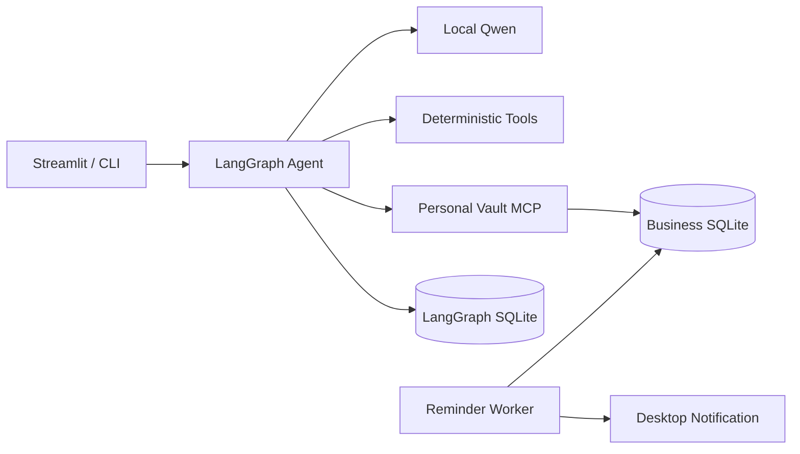

# LifeVault

LifeVault v1.0 is a local-first life record and reminder assistant. It uses local Qwen for language understanding, LangGraph for human-in-the-loop create and update workflows, MCP for the personal vault data boundary, deterministic Python tools for dates and validation, SQLite for durable records, and a reminder worker for local notifications.

For a version-by-version implementation walkthrough, see [skill.md](skill.md).
Release evidence and operational boundaries are documented in [the v1.0 audit](docs/V1_RELEASE_AUDIT.md), [the three-minute demo](docs/DEMO.md), [the changelog](CHANGELOG.md), and [the security policy](SECURITY.md).

## Current MVP

Implemented chain:

```text
natural language -> Qwen/fallback extraction -> LangGraph interrupts
-> deterministic tools -> user confirmation -> MCP Client -> MCP Server
-> SQLite record -> reminder confirmation -> SQLite reminder -> worker notification

saved record -> MCP update preview -> user confirmation
-> optimistic-lock update + reminder replan + audit in one SQLite transaction

natural update -> target extraction -> MCP search -> explicit target selection
-> typed patch extraction -> deterministic date freeze -> MCP preview
-> user correction/confirmation -> atomic MCP update

archive/restore intent -> active/archived MCP search -> explicit selection
-> lifecycle preview -> user confirmation -> atomic archive or restore
```

The model does not write the database or send notifications. It only produces a candidate record and a tool plan. The Agent validates fields, calculates dates, checks duplicates through MCP, and requires confirmation before saving. LangGraph persists interrupted workflows in the configured checkpoint database; a source checkout defaults to `data/langgraph_checkpoints.sqlite`.



v0.5 adds a focused subscription renewal loop:

- Natural-language subscription capture for service name, amount, billing cycle, auto-renew state, renewal date, and reminder offset.
- Deterministic renewal parsing for exact dates, relative dates, `每月X号`, `下个月X号`, `每年X月X日`, `明年X月X日`, and weekly anchors.
- Subscription records store the next renewal date in `deadline` and subscription metadata in `details`.
- Renewal reminders use `reminder_type=renewal`.
- MCP and CLI can list upcoming subscription renewals.

v0.6 tightens the MCP data boundary:

- Agent natural-language search calls MCP `search_records` instead of reading SQLite directly.
- CLI record search/list, reminder list, status updates, and subscription renewal queries use the in-process MCP client.
- Streamlit record and reminder pages use MCP for searches, status updates, reminder lists, and reminder cancellation.
- MCP failures are shown explicitly; UI and CLI do not silently fall back to repository access.
- Settings still use the local repository directly for user preferences.

v0.7 hardens reminder delivery:

- ReminderWorker accepts injectable notification providers and has tests for success, failure, inactive records, repeated runs, and quiet hours.
- Quiet hours automatically snooze due reminders to the quiet-hours end time, preserving parent/child reminder history.
- Desktop notification failure still falls back to console output, but the reminder is marked `failed` because the target channel did not deliver.
- CLI and Streamlit reminder center can snooze pending reminders through MCP.

v0.8 adds an extraction evaluation baseline:

- The extraction set, now packaged at `lifevault/eval/data/examples.jsonl`, began with 60 hand-written purchase, subscription, bill, search, and missing-field cases.
- `python -m lifevault.cli eval` runs a dry-run extractor evaluation without saving records or creating reminders.
- Evaluation defaults to the deterministic fallback extractor for reproducible local results; `--use-qwen` can run the configured local Qwen manually.
- Optional `--json-out` writes per-case expected/actual/mismatch details.
- Current fallback baseline on the included 60 cases: intent accuracy 100.0%, record type accuracy 93.2%, field accuracy 85.4%, full-case accuracy 48.3%.

v0.9 improves the deterministic fallback extractor against that baseline:

- Known subscription services and bill names improve record-type classification for short inputs such as `ChatGPT Plus 每月 20 美元` and standalone fee names.
- Amount extraction accepts USD wording: `美元`, `美金`, `USD`, and `$`.
- Subscription renewal extraction covers monthly, yearly, relative, and date-before-action phrasings used in the eval set.
- Bill due-date extraction handles date-before-action and action-before-date forms.
- Purchase merchant/title extraction handles platform names with spaces and common quantifiers.
- Current fallback result on the included 60 cases: intent accuracy 100.0%, record type accuracy 100.0%, field accuracy 100.0%, full-case accuracy 100.0%.

v0.10 makes state-changing tool calls and reminder delivery auditable:

- Successful record/reminder mutations write their audit event in the same SQLite transaction, without duplicate MCP-side success logs.
- MCP validation rejections and write failures are recorded with stable error codes; Worker send success, failure, and automatic cancellation are also recorded.
- Audit summaries use action-specific field and value allowlists. Raw input, titles, notes, reminder messages, search terms, idempotency keys, and exception details are excluded.
- MCP `list_audit_logs` provides actor/action/result filters and `before_id` cursor pagination for the configured local user.
- CLI `audit` and the Streamlit audit tab read through MCP instead of accessing SQLite directly.
- Audit records are append-only in v0.10; editing, deletion, export, cleanup, and retention policies are intentionally out of scope.

v0.11 closes the user-preference Memory boundary:

- MCP `get_preferences` and `update_preferences` expose default reminder time, default advance days, and optional quiet hours for the configured local user.
- Preference updates are partial, strictly validated, require explicit confirmation, and return the complete current preference plus `changed` and `changed_fields`.
- Actual changes and their audit event share one SQLite transaction. No-op updates do not write data or audit noise, and audit summaries contain field names rather than schedule values.
- Agent reminder planning reads defaults through MCP; Streamlit settings and CLI preference commands no longer access the repository directly. The trusted Worker continues to read preferences from the repository.
- The fallback extractor no longer invents a two-day reminder offset when the user only says “提醒我”; the saved preference now supplies that default.
- Existing invalid time values are safely treated as defaults during reads, allowing databases created by earlier permissive settings pages to upgrade without a migration.

v0.12 turns subscription renewal reminders into a recurring loop:

- After an active auto-renewing subscription passes its current renewal date, the Worker advances its `deadline` and creates the next renewal reminder.
- The record update, reminder creation, and privacy-filtered audit event share one SQLite transaction with optimistic version checks and a stable idempotency key.
- Monthly and yearly rollovers preserve the original renewal anchor, including month-end dates such as the 31st and leap-day annual renewals.
- A long Worker pause fast-forwards to the next reminder that is still in the future instead of emitting several obsolete cycles.
- Manual renewals, cancelled subscriptions, cancelled renewal reminders, and subscriptions whose reminder was skipped are not rolled forward automatically.

v0.13 adds typed purchase deadlines and atomic multi-reminder workflows:

- Purchase records can carry independent `return_deadline` and `warranty_deadline` values. Warranty dates support explicit dates or calendar-month durations with safe month-end handling.
- Reminder intent and advance days are extracted independently for return and warranty deadlines. No reminder is proposed unless the user asks for one.
- LangGraph previews all reminder candidates in one interrupt. Streamlit can select individual reminders, while CLI confirmation selects the complete batch.
- MCP `create_reminders` validates one to five reminders for a single record and commits them atomically. A persisted request hash makes exact retries idempotent and rejects reuse of the same key with different content.
- Batch audits contain only reminder count and type summaries. Existing single-reminder MCP calls and v0.12 checkpoints remain compatible.
- Completed purchases still receive warranty reminders; returned or cancelled purchases do not.
- The fallback evaluation now contains 72 cases and passes 72/72 cases and 448/448 expected fields.

v0.14 adds a typed record-review loop before save:

- Streamlit replaces the read-only record JSON with record-type-specific fields and a computed record/reminder summary.
- Applying corrections is separate from saving. The complete correction batch is validated atomically, and recoverable failures return field-specific errors without changing the last valid candidate.
- Relative dates are frozen into typed dates at the first review so a restored checkpoint cannot reinterpret `昨天` or `月底` on a different day.
- Applying a valid change reruns deterministic validation, deadline and reminder calculation, and the final MCP duplicate check.
- Exact return and warranty dates override duration calculations with a visible warning. Logically impossible purchase and subscription date orderings are rejected.
- Streamlit disables save while edits are unapplied. CLI scripts can use `resume THREAD_ID --corrections-json '{...}'`.
- Save idempotency uses the normalized final record. v0.13 record, duplicate-review, and reminder checkpoints remain resumable.
- In v0.14, saved-record editing, record-type changes, OCR/PDF import, draft history, and post-save reminder replanning remained out of scope.

v0.15 closes the saved-record editing and reminder-consistency loop:

- `RecordUpdatePatch` accepts strict type-specific partial changes. Missing fields stay unchanged, explicit `null` clears optional values, and record type/system metadata remain immutable.
- MCP `preview_record_update` returns the proposed record, field list, warnings, duplicate candidates, and exact reminder cancellation/creation plan without writing.
- MCP `update_record` requires explicit confirmation, optimistic `expected_version`, and a stable idempotency key. Exact retries return the original result; conflicting key reuse is rejected.
- Duplicate-sensitive edits rerun duplicate detection excluding the current record and require separate confirmation when matches exist.
- Record updates, reminder cancellation/replacement, privacy-filtered audit, and idempotency result storage commit in one SQLite transaction.
- Affected pending/snoozed reminder history is preserved through replacement parent links. Sent/failed/cancelled history is unchanged, and updates fail while an affected reminder is being sent.
- Reminder scheduling preserves the latest effective offset and clock time. Past deadlines skip replacement; elapsed advance times are scheduled immediately.
- Existing reminder rows are migrated without data loss from global slot uniqueness to uniqueness for active reminder slots only, allowing title-only replacement at the same time.
- Streamlit provides record-type-specific saved-record forms with preview-before-confirmation. CLI supports JSON partial updates and `--dry-run`.
- Record-type changes, natural-language persisted updates, deletion, OCR/PDF import, and draft history remain out of scope.

v0.16 adds controlled natural-language updates for persisted records:

- A separate `RecordUpdateGraphAgent` handles target search, explicit target selection, patch extraction, preview, structured correction, confirmation, and resumable checkpoints.
- Qwen runs in two stages: first it proposes search intent without IDs, then it proposes an absolute typed patch after the user selects a record. Deterministic rules constrain explicit values, clearing, status intent, and external-action refusal.
- The Graph, not the model, calls MCP tools and creates record IDs, versions, confirmation flags, and idempotency keys. Even one search result requires explicit selection unless a per-record UI preselects it.
- Relative date text is parsed deterministically and frozen in the checkpoint. Only absolute assignments and explicit clears are accepted; arithmetic changes such as “add 10” or “push three days” require clarification.
- Content changes and status changes are separate operations. Requests to make payments, issue refunds, stop charges, or cancel an external subscription are refused rather than treated as local status changes.
- Status updates now have `preview_record_status_update`, type-specific status allowlists, explicit confirmation, optimistic locking, idempotency, and atomic cancellation of invalid pending/snoozed reminders.
- Streamlit supports natural edits globally and from an individual record. CLI adds `edit`, `edit-resume`, and `edit-state`; the existing `status` command now previews before writing.
- The update set, now packaged at `lifevault/eval/data/update_examples.jsonl`, and `eval-updates` evaluate the target and patch stages. Both fallback and the configured local Qwen pass 24/24 included cases and 54/54 expected fields.

v0.17 adds recoverable record archive and restore:

- Records use an independent nullable `archived_at` lifecycle field; business `status` and record content are preserved.
- Archiving atomically increments the record version, cancels every pending/snoozed reminder, writes a privacy-filtered audit event, and stores an idempotent result. A sending reminder blocks the whole transaction.
- Restoring clears `archived_at` and increments the version, but deliberately does not recreate reminders cancelled during archive.
- MCP adds `preview_record_archive`, `archive_record`, `preview_record_restore`, and `restore_record`. Collection searches accept `archive_scope=active|archived|all` and default to active records; `get_record` still returns archived records by ID.
- Natural “delete this record” means recoverable archive. Field deletion remains a typed clear, while ambiguous phrases such as `恢复 ChatGPT Plus` and `删除它` require clarification. Lifecycle operations skip the second patch-extraction model call.
- Archived records cannot be edited or have their status changed until restored. Duplicate review still finds archived candidates and labels them as archived.
- Worker delivery and subscription rollover exclude archived records. Streamlit adds current/archived record views with preview-confirm actions; CLI adds `archive` and `restore` commands with `--dry-run` and `--yes`.
- The natural-update evaluation now contains 36 cases. Both fallback and the configured local Qwen pass 36/36 cases and 87/87 expected fields.

v0.18 adds encrypted full-vault backup and crash-safe restore:

- A mandatory-password `.lvbackup` v1 container encrypts a strict ZIP payload containing the business database, LangGraph checkpoint database, and encrypted manifest.
- scrypt (`N=2^17, r=8, p=1`) derives a 256-bit key; streaming AES-256-GCM authenticates the canonical public header and encrypted payload.
- SQLite online backup creates consistent snapshots. Restore validates checksums, schema fingerprints, SQLite integrity, format/app/schema versions, configured user scope, paths, and resource limits before replacement.
- Restore creates a separately usable encrypted safety backup, then coordinates both databases with `flock`, same-filesystem candidates, rollback files, a durable restore journal, WAL checkpointing, and startup recovery.
- Successful restore changes the vault generation and pauses ReminderWorker. CLI or Streamlit must explicitly resume it after reviewing overdue reminders.
- CLI adds `backup create/list/inspect/import/restore/status/resume-worker`; Streamlit adds a sixth “备份与恢复” tab. Backup authority is deliberately absent from MCP.
- Backups are never automatically deleted. JSON/CSV, selective/merge/incremental/cloud/scheduled backups and password recovery remain out of scope.

v0.19 makes the source tree an installable and relocatable local application:

- Standard package metadata produces a real `lifevault-0.19.0` wheel with the complete Python package instead of an empty `UNKNOWN-0.0.0` artifact.
- Console commands `lifevault` and `lifevault-mcp` are installed with the package.
- `lifevault serve` supervises Streamlit and ReminderWorker together, finds the next free loopback port, and shuts down both children cleanly on Ctrl-C.
- Remote binding is rejected because the current app has no network authentication boundary.
- Installed builds keep mutable state in a user-owned platform data directory. `LIFEVAULT_HOME` relocates the business database, checkpoint database, backups, locks, and runtime files together.
- Purchase, subscription, and bill Skills plus both JSONL evaluation sets are packaged into the wheel. Qwen now loads only the selected record-type Skill for create-record extraction; search extraction loads none.
- Explicit values found by deterministic parsing constrain Qwen output without discarding model-only fields. This canonicalizes titles/date text and prevents invented reminder intent; the configured local Qwen passes all 72 extraction cases and 448 expected fields.

v1.0 closes the release-readiness loop:

- `lifevault doctor` performs read-only checks for Python/platform support, direct dependency ranges, packaged Skills/evaluation data, writable state paths, SQLite integrity/schema compatibility, pending restore recovery, Worker pause state, and the configured local Qwen model. `--json` supports automation and `--strict` turns warnings into a release failure.
- The final wheel is tested with a complete dependency installation outside the repository, not only against the development environment.
- Browser-driven desktop and mobile checks verify that the Streamlit add, records, reminders, and backup views finish rendering without blank output, skeleton residue, or overlapping controls.
- `CHANGELOG.md`, `SECURITY.md`, a requirement-by-requirement release audit, and a reproducible three-minute demo define what v1.0 proves and what remains outside the local MVP.
- v1.0 supports Python 3.10+ on POSIX systems with `fcntl.flock`. The UI remains loopback-only and must not be exposed as an unauthenticated remote service.

Create-record interrupts:

- `missing_fields`: resume with natural language supplement.
- `duplicate_review`: choose `continue` or `cancel`.
- `record_confirmation`: apply structured `corrections`, then choose `confirm` or `cancel`.
- `reminder_confirmation`: choose `confirm` or `skip`.

Natural-update interrupts:

- `missing_target`: provide a record name, type, or date clue.
- `target_not_found`: refine the target search or cancel.
- `target_selection`: explicitly choose one returned record.
- `missing_update_details`: provide an absolute new value or explicit clear.
- `update_confirmation`: apply typed corrections, then confirm or cancel.

## Local Qwen

Defaults match the local vLLM service found on this machine:

```text
LIFEVAULT_QWEN_BASE_URL=http://127.0.0.1:8008/v1
LIFEVAULT_QWEN_MODEL=qwen-enterprise-agent
```

If Qwen is unavailable or returns invalid JSON, the app falls back to a small rules-based extractor. For updates, deterministic matches constrain and safely merge Qwen output instead of allowing model output to override explicit values or destructive-clear rules.

## Setup

```bash
python3 -m venv .venv
. .venv/bin/activate
pip install -e .
lifevault init-db
lifevault doctor --strict
lifevault serve
```

`lifevault serve` prints the local URL, starts the Reminder Worker, and keeps both processes under one supervisor. Use `--no-worker` for UI-only debugging or `--port 0` to request any free loopback port.

`lifevault doctor` is read-only. On a brand-new install it reports uninitialized databases as warnings; after `init-db`, `doctor --strict` must pass without warnings. Qwen unavailability is a warning because the deterministic fallback remains supported; use `--no-qwen` for an intentionally offline installation.

Source checkouts preserve the existing `./data` default. Installed wheels use a user-owned platform data directory, such as `~/.local/share/lifevault` on Linux. Set one root before startup to make the location explicit:

```bash
export LIFEVAULT_HOME="$HOME/.lifevault"
lifevault serve
```

On this machine, `python3-venv` is not installed and `HTTP_PROXY/HTTPS_PROXY` can point at an unavailable local proxy. The verified fallback is:

```bash
env -u HTTP_PROXY -u HTTPS_PROXY -u http_proxy -u https_proxy python3 -m pip install --user -e .
lifevault init-db
```

## CLI Demo

```bash
python -m lifevault.cli add "我昨天在京东买了一个耳机，3499 元，订单号 123456，七天无理由，退货前两天提醒我。" --yes
python -m lifevault.cli add "我 2026-07-25 买了一个相机，5000 元，七天退货，保修两年，退货前 2 天、保修到期前 60 天提醒我。" --yes
python -m lifevault.cli add "我订阅了腾讯视频会员，每月 30 元，每月 15 号自动续费，续费前 3 天提醒我。" --yes
python -m lifevault.cli list
python -m lifevault.cli subscriptions --days 30
python -m lifevault.cli reminders
python -m lifevault.cli audit --result failed
python -m lifevault.cli audit --actor mcp --limit 20 --json
python -m lifevault.cli preferences show
python -m lifevault.cli preferences set --default-time 08:30 --advance-days 3 --yes
python -m lifevault.cli preferences set --quiet-start 22:00 --quiet-end 08:00 --yes
python -m lifevault.cli preferences set --clear-quiet-hours --yes
python -m lifevault.cli snooze-reminder REMINDER_ID --minutes 60
python -m lifevault.cli snooze-reminder REMINDER_ID --at 2026-08-01T09:00:00+08:00
python -m lifevault.cli update RECORD_ID VERSION --changes-json '{"title":"新标题","return_deadline":"2026-08-08"}' --dry-run
python -m lifevault.cli update RECORD_ID VERSION --changes-json '{"title":"新标题","return_deadline":"2026-08-08"}' --yes
python -m lifevault.cli update RECORD_ID VERSION --changes-json '{"order_number":"ORDER-100"}' --yes --confirm-duplicate
python -m lifevault.cli edit "把 ChatGPT Plus 的月费改成 25 美元"
python -m lifevault.cli edit "下次续费日改到下个月 20 号" --record-id RECORD_ID --yes
python -m lifevault.cli status RECORD_ID cancelled VERSION --dry-run
python -m lifevault.cli status RECORD_ID cancelled VERSION --yes
python -m lifevault.cli archive RECORD_ID VERSION --dry-run
python -m lifevault.cli archive RECORD_ID VERSION --yes
python -m lifevault.cli list --archive-scope archived
python -m lifevault.cli restore RECORD_ID VERSION --yes
python -m lifevault.cli backup create
python -m lifevault.cli backup list
python -m lifevault.cli backup inspect BACKUP_ID
python -m lifevault.cli backup import /path/to/file.lvbackup
python -m lifevault.cli backup restore BACKUP_ID
python -m lifevault.cli backup status
python -m lifevault.cli backup resume-worker
python -m lifevault.cli worker --once
python -m lifevault.cli eval
python -m lifevault.cli eval --json-out eval_report.json
python -m lifevault.cli eval-updates
python -m lifevault.cli eval-updates --use-qwen --json-out update_eval_report.json
```

Resume an interrupted graph thread:

```bash
python -m lifevault.cli state THREAD_ID
python -m lifevault.cli resume THREAD_ID --text "金额是 3499 元，订单号是 123456"
python -m lifevault.cli resume THREAD_ID --corrections-json '{"amount": 3599, "return_days": 14}'
python -m lifevault.cli resume THREAD_ID --action confirm
python -m lifevault.cli resume THREAD_ID --action skip
python -m lifevault.cli edit-state EDIT_THREAD_ID
python -m lifevault.cli edit-resume EDIT_THREAD_ID --record-id RECORD_ID
python -m lifevault.cli edit-resume EDIT_THREAD_ID --text "金额改成 25 美元"
python -m lifevault.cli edit-resume EDIT_THREAD_ID --changes-json '{"amount":25,"currency":"USD"}'
python -m lifevault.cli edit-resume EDIT_THREAD_ID --action confirm
```

## MCP Server

Run the Personal Vault MCP server over stdio:

```bash
python3 -m lifevault.mcp_server.server
```

The CLI wrapper is equivalent:

```bash
python3 -m lifevault.cli mcp-server
```

Run a real stdio MCP smoke test:

```bash
python3 -m lifevault.cli mcp-smoke
```

MCP tools:

```text
save_record
search_records
list_upcoming_subscriptions
get_record
preview_record_update
update_record
preview_record_status_update
get_preferences
find_duplicate
update_record_status
preview_record_archive
archive_record
preview_record_restore
restore_record
update_preferences
create_reminder
create_reminders
list_reminders
snooze_reminder
cancel_reminder
list_audit_logs
```

All tools use the configured local user from `LIFEVAULT_USER_ID`; `user_id` is not exposed as a tool argument. Tool responses use JSON objects with either `ok: true` and data fields or `ok: false` with an error object. `save_record`, `update_record`, `update_record_status`, `archive_record`, `restore_record`, `create_reminder`, `create_reminders`, `cancel_reminder`, and `update_preferences` require `user_confirmed=true`. Record, status, and lifecycle updates also require `expected_version` and `idempotency_key`; possible duplicate content edits require `duplicate_confirmed=true`. The Graph agents use an in-process `PersonalVaultMcpClient`; models only produce candidates and never call write tools or construct authority fields. The CLI and Streamlit use the same MCP client for vault access, while the stdio MCP server remains available for external clients and integration smoke tests.

## Streamlit

```bash
lifevault serve
```

Open the URL printed by Streamlit. The app has six tabs: add record, records, reminders, audit, settings, and backup/restore. The backup tab creates, imports, validates, downloads, previews, and restores encrypted full-vault snapshots. Restore controls only appear after password-authenticated inspection and require a second password plus the complete backup ID.

For UI-only development without the supervised Worker:

```bash
python3 -m streamlit run lifevault/app/main.py
```

## Backup Security Boundary

- Default backup directory: `data/backups`; set `LIFEVAULT_BACKUP_DIR` before startup to choose another fixed directory.
- Passwords contain 12–256 Unicode characters, are NFC-normalized, and are never accepted through CLI arguments, environment variables, config, audit, or MCP.
- The encrypted file limit is 512 MiB and the combined decrypted database limit is 1 GiB. Backup and restore also fail closed on insufficient disk space.
- Restore is full replacement, never merge. A durable encrypted safety backup must succeed before either active database is replaced.
- A restored vault preserves absolute reminder timestamps but pauses Worker until explicit resume. Source/target timezone differences are shown in the preview.
- Losing the password means losing access to that backup. LifeVault has no password persistence, recovery key, bypass, or downgrade switch.

## Tests

```bash
python -m unittest discover -s tests -v
python -m pip wheel . --no-deps --wheel-dir dist
python -m lifevault.cli doctor --strict
python -m lifevault.cli eval
python -m lifevault.cli eval-updates
python -m lifevault.cli mcp-smoke
```

## Release Scope

- Supported runtime: Python 3.10+ on POSIX with local file locking.
- Supported deployment: one local user, loopback UI, local SQLite, optional local OpenAI-compatible Qwen endpoint.
- Active databases are plaintext local files; use operating-system permissions and encrypted `.lvbackup` files for portable copies.
- OCR/PDF import, cloud sync, remote access, multi-user authorization, PostgreSQL, external payment/cancellation, physical deletion, and scheduled/cloud/incremental backup are intentionally outside v1.0.
- The repository does not currently grant an additional open-source reuse license. Deployment does not require a license file, but redistribution terms should be decided separately by the owner.

See the [three-minute walkthrough](docs/DEMO.md) and its [silent MP4](docs/lifevault-v1-demo.mp4) for a compact product demonstration.

## Project Shape

- `lifevault/models`: Pydantic schemas and Qwen adapter.
- `lifevault/diagnostics.py`: read-only install, resource, database, runtime, and Qwen checks.
- `lifevault/skills`: packaged task instructions loaded selectively for Qwen extraction.
- `lifevault/eval/data`: packaged extraction and natural-update evaluation sets.
- `lifevault/tools`: deterministic tools for dates, idempotency, and notifications.
- `lifevault/storage`: SQLite schema and repository.
- `lifevault/backup`: encrypted container, locks, runtime generation, safety backup, restore journal, and validation.
- `lifevault/records`: deterministic persisted-record update and reminder-replan planning.
- `lifevault/agent`: independent LangGraph create-record and natural-update workflows.
- `lifevault/mcp_server`: FastMCP stdio server, in-process MCP client, and smoke client.
- `lifevault/app`: Streamlit UI.
- `lifevault/runtime`: local Streamlit/Worker process supervisor.
- `lifevault/worker`: reminder scanner and notification sender.
